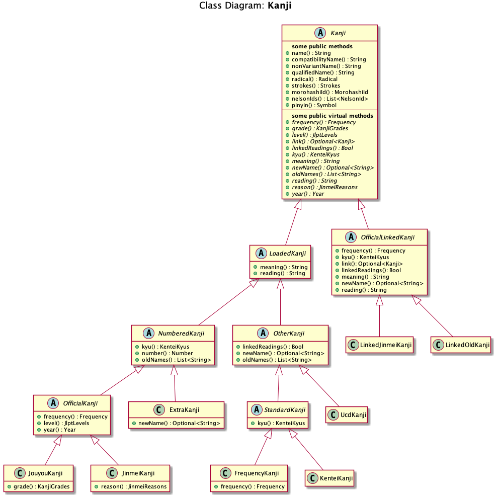

# C++ kanji Tools

[TOC] <!--[TOC] adds a Table of Contents for Doxygen-->
[GitHub](http://github.com) automatically generates a Table of Contents in the header since [this change](https://github.blog/changelog/2021-04-13-table-of-contents-support-in-markdown-files/) in April 2021. Note, relative links to directories and some file types don't work from the [Doxygen](https://doxygen.nl) generated main page.

## Introduction

This repository contains code for four *main* programs:

- **kanaConvert**: program that converts between Hiragana, Katakana and Rōmaji
- **kanjiFormat**: program used to format **[sample-data](tests/stats/sample-data/books)** files (from 青空文庫 - see below)
- **kanjiQuiz**: interactive program that allows a user to choose from various types of quizzes
- **kanjiStats**: classifies and counts multi-byte characters in a file or directory tree

The initial goal for this project was to create a program that could parse multi-byte (UTF-8) input and classify **Japanese Kanji (漢字)** characters into *official* categories in order to determine how many Kanji fall into each category in real-world examples. The *quiz* program was added later once the initial work was done for loading and classifying Kanji. The *format* program was created to help with a specific use-case that came up while gathering sample text from [Aozora](https://www.aozora.gr.jp) - it's a small program that relies on some of the generic code created for the *stats* program.

### Project Structure

The project is build using [cmake](https://cmake.org/) (installed via Homebrew) so there is a *CMakeLists.txt* file in the top directory that builds five *libs* (C++ static libraries for now), the four main programs (mentioned in the Introduction) plus all the test code. The tests are written using **[GoogleTest](https://github.com/google/googletest.git)** test framework. The project has the following directories:

- **apps**: *CMakeLists.txt* and a *.cpp* file for each main program
- **build**: generated for build targets and *cmake* dependencies
- **data**: data files described in **[Kanji Data](#Kanji-Data)** section
- **docs**: docs and **[PlantUML](https://plantuml.com)** diagrams
- **scripts**: *.sh* bash scripts for working with *Unicode* data files
- **libs**: has a directory per lib, each containing:
  - **include**: *.h* files for the lib
  - **src**: *CMakeLists.txt* and *.cpp* files for the lib
- **tests**: has *testMain.cpp*, an *include* directory and a directory per lib:
  - each sub-directory has *CMakeLists.txt* and *.cpp* files

The five libraries are:

- **utils**: utility classes used by all 4 main programs
- **kana**: code used by *kanaConvert* program (depends on **utils** lib)
- **kanji**: code for loading Kanji and Ucd data (depends on **kana** lib)
- **stats**: code used by *kanjiStats* program (depends on **kanji** lib)
- **quiz**: code used by *kanjiQuiz* program (depends on **kanji** lib)

### VS Code Setup

The code was written using **[VS Code](https://code.visualstudio.com)** IDE on an *M1 Mac* and compiles with either **clang++** (version 14.0.3) installed via *Xcode* command-line tools (`xcode-select --install`) or **g++-13** (version 13.1.0) installed via **[Homebrew](https://brew.sh)** (`brew install gcc`). Some other useful brew formulas for this project are: `bash`, `clang-format`, `cmake`, `doxygen` and `gcovr`). It should also build on other *Unix*/*Linux* systems, but there are assumptions related to `wchar_t` and multi-byte handling that won't currently compile on *Windows 10*.

Here are some links that might help with setup:

- **[VS Code - Clang on macOS](https://code.visualstudio.com/docs/cpp/config-clang-mac)**
- **[VS Code - Build with CMake](https://code.visualstudio.com/docs/cpp/cmake-linux)**
- **[VS Code - December 2021 Update: clang-tidy](https://devblogs.microsoft.com/cppblog/visual-studio-code-c-december-2021-update-clang-tidy)**

Here's a list of VS Code extensions being used:

- Code/Build: **[C/C++](https://marketplace.visualstudio.com/items?itemName=ms-vscode.cpptools)**, **[CMake Tools](https://marketplace.visualstudio.com/items?itemName=ms-vscode.cmake-tools)**, **[CMake Language Support](https://marketplace.visualstudio.com/items?itemName=josetr.cmake-language-support-vscode)**, **[Makefile Tools](https://marketplace.visualstudio.com/items?itemName=ms-vscode.makefile-tools)**, **[.NET](https://marketplace.visualstudio.com/items?itemName=ms-dotnettools.vscode-dotnet-runtime)**
- Format: **[Code Spell Checker](https://marketplace.visualstudio.com/items?itemName=streetsidesoftware.code-spell-checker)**, **[shell-format](https://marketplace.visualstudio.com/items?itemName=foxundermoon.shell-format)**
- Test: **[C++ TestMate](https://marketplace.visualstudio.com/items?itemName=matepek.vscode-catch2-test-adapter)**, **[Test Adapter Converter](https://marketplace.visualstudio.com/items?itemName=ms-vscode.test-adapter-converter)**, **[Test Explorer UI](https://marketplace.visualstudio.com/items?itemName=hbenl.vscode-test-explorer)**
- Debug: **[CodeLLDB](https://marketplace.visualstudio.com/items?itemName=vadimcn.vscode-lldb)**, **[Hex Editor](https://marketplace.visualstudio.com/items?itemName=ms-vscode.hexeditor)**
- Docs: **[Doxygen Document Generator](https://marketplace.visualstudio.com/items?itemName=cschlosser.doxdocgen)**, **[PlantUML](https://marketplace.visualstudio.com/items?itemName=jebbs.plantuml)**
- Aesthetic: **[Better Comments](https://marketplace.visualstudio.com/items?itemName=aaron-bond.better-comments)**, **[Clock](https://marketplace.visualstudio.com/items?itemName=angelo-breuer.clock)**

**Notes**:

- **Better Comments**: can help distinguish `///` Doxygen comments by using a different color for tag "/" in "better-comments.tags" (in User Settings)
- **Code Spell Checker**: there are lots of *word* entries for this extension in **[.vscode/settings.json](.vscode/settings.json)** (mainly caused by all the Japanese words in test code)
- **CodeLLDB**: current setup has some limitations (see comments in **[.vscode/launch.json](.vscode/launch.json)** for more details)
- **PlantUML** is used to generate diagrams from the *.txt* files in **[docs/diagrams/src](docs/diagrams/src)**. In order to generate them locally **graphviz** must be installed. On Mac this can be done via `brew install --cask temurin; brew install graphviz`

### Compiler Diagnostic Flags

The code builds without warnings using a large set of diagnostic flags such as **-Wall**, **-Wextra** (equivalent to **-W**), **-Wconversion**, etc.. **-Werror** is also included to ensure the code remains warning-free. Finally, only one type of warning has been disabled (requiring parentheses for some expressions that seemed excessive). **clang-tidy** (which is nicely integrated with **VS Code**) is also being used for diagnostics (see **[.clang-tidy](.clang-tidy)** for details on what's being checked).

The following table shows flags used per compiler (**Common** shows flags used for both). Diagnostics enabled by default or enabled via another flag such as **-Wall** are not included (at least that's the intention):

| Compiler | Standard | Diagnostic Flags | Disabled |
| --- | --- | --- | --- |
| Common | | -Wall -Wconversion -Wdeprecated -Werror -Wextra -Wextra-semi -Wignored-qualifiers -Wnonnull -Wold-style-cast -Wpedantic -Wsuggest-override -Wswitch-enum -Wzero-as-null-pointer-constant | |
| Clang | c++2a | -Wcovered-switch-default -Wduplicate-enum -Wheader-hygiene -Wloop-analysis -Wshadow-all -Wsuggest-destructor-override -Wunreachable-code-aggressive | -Wno-logical-op-parentheses |
| GCC | c++20 | -Wnon-virtual-dtor -Woverloaded-virtual -Wshadow -Wuseless-cast | -Wno-parentheses |

**Notes**:

- **-Wpedantic** means 'Issue all the warnings demanded by strict ISO C++'
- **-Wswitch-enum** happens even when a 'default' label exists (so it's very strict) whereas **-Wswitch** (enabled by default) only warns about a missing enum value when there is no 'default'.
- Here are links for more info:
  - **Clang**: https://clang.llvm.org/docs/DiagnosticsReference.html
  - **GCC**: https://gcc.gnu.org/onlinedocs/gcc/Warning-Options.html

### C++ Features

An effort was made to use modern C++ features including **C++ 11** `std::move`, `std::forward`, `std::make_shared`, `nullptr`, `noexcept`, `constexpr`, etc.. Also, [uniform initialization](https://en.wikipedia.org/wiki/C%2B%2B11#Uniform_initialization) and [type inference](https://en.wikipedia.org/wiki/C%2B%2B11#Type_inference) are used whenever possible for consistency. Below, are lists of some specific features used from the latest three **C++** standard versions:

**C++ 20**:

- [`concept`](https://en.wikipedia.org/wiki/Concepts_(C%2B%2B)), [`consteval`](http://www.open-std.org/jtc1/sc22/wg21/docs/papers/2018/p1073r2.html) and [`constinit`](http://open-std.org/JTC1/SC22/WG21/docs/papers/2019/p1143r2.html), initializers in range-based `for`
- [`[=, this]`](https://wg21.link/p0409) as lambda capture, [templated lambdas](https://wg21.link/p0428)
- [three-way comparison](https://en.wikipedia.org/wiki/Three-way_comparison), [class types](http://www.open-std.org/jtc1/sc22/wg21/docs/papers/2018/p0732r2.pdf) in non-typed templates
- [`using` on scoped enums](http://open-std.org/JTC1/SC22/WG21/docs/papers/2019/p1099r5.html), `contains`, `starts_with` and `ends_with`

**C++ 17**:

- `if constexpr (expression)`, `[[nodiscard]]`, initializers in `if` and `switch`
- [`auto` for non-typed template](http://www.open-std.org/jtc1/sc22/wg21/docs/papers/2016/p0127r2.html), new rules for [`auto` type deduction](http://www.open-std.org/jtc1/sc22/wg21/docs/papers/2014/n3922.html)
- class template argument deduction ([CTAD](https://en.cppreference.com/w/cpp/language/class_template_argument_deduction)), so don't need `std::make_pair`, etc..
- inline variables (don't violate [one definition rule](https://www.google.com/url?sa=t&rct=j&q=&esrc=s&source=web&cd=&cad=rja&uact=8&ved=2ahUKEwii3O2O_cP4AhXOEc0KHRwXBpQQFnoECAgQAQ&url=https%3A%2F%2Fen.cppreference.com%2Fw%2Fcpp%2Flanguage%2Fdefinition&usg=AOvVaw0wwYTjnXINc7qeLpCzfkDu)), optional `static_assert` message
- `std::filesystem`, `std::string_view`, `std::optional` and `std::size`
- `_v` helpers instead of `value`, i.e., `std::is_unsigned_v`

**C++ 14**:

- [function return deduction](https://en.wikipedia.org/wiki/C%2B%2B14#Function_return_type_deduction), [relaxed constexpr restrictions](https://en.wikipedia.org/wiki/C%2B%2B14#Relaxed_constexpr_restrictions), [variable templates](https://en.wikipedia.org/wiki/C%2B%2B14#Variable_templates)
- [binary literals](https://en.wikipedia.org/wiki/C%2B%2B14#Binary_literals), [digit separators](https://en.wikipedia.org/wiki/C%2B%2B14#Digit_separators), [generic lambdas](https://en.wikipedia.org/wiki/C%2B%2B14#Generic_lambdas)
- `_t` helpers instead of `type`, i.e., `std::underlying_type_t`

## Kana Convert

The **kanaConvert** program was created to parse the *UniHan XML* files (from Unicode Consortium) which have 'On' (音) and 'Kun' (訓) readings, but only in Rōmaji. The program can read stdin and supports various flags for controlling conversion (like *Hepburn* or *Kunrei*) and it has an interactive mode. Here are some examples:

```
$ kanaConvert atatakai
あたたかい
$ kanaConvert kippu
きっぷ
$ echo kippu | kanaConvert -k  # can be used in pipes
キップ
$ echo ジョン・スミス | kanaConvert -r
jon/sumisu
$ echo かんよう　かんじ | kanaConvert -r
kan'you kanji
$ kanaConvert -r ラーメン  # uses macrons when converting from 'prolong mark'
rāmen
$ kanaConvert -h rāmen
らーめん
$ kanaConvert -r こゝろ  # supports repeat marks
kokoro
$ kanaConvert -r スヾメ
suzume
$ kanaConvert -k qarutetto  # supports multiple romaji variants:
クァルテット
$ kanaConvert -k kwarutetto
クァルテット
```

### Kana Conversion Chart

Passing '-p' to **kanaConvert** causes it to print out a Kana Chart that shows the Rōmaji letter combinations that are supported along with some notes and totals. The output is aligned properly in a terminal using a fixed font (or an IDE depending on the font - see **[Table.h](libs/kana/include/kanji_tools/kana/Table.h)** for more details). However, the output doesn't align properly in a Markdown code block (wide to narrow character ratio isn't exactly 2:1) so there's also a '-m' option to print using markdown formatting.

- Note: the terminal output (-p) puts a border line between sections (sections for the Kana chart table are groups of related Kana symbols, i.e., 'a', 'ka', 'sa', etc.), but for markdown (-m) rows starting a section are in bold instead:

[Kana Conversion Chart](docs/KanaConversionChart.md)

### Kana Class Diagram

The following diagram shows the **Kana** class hierarchy as well as some of the public methods.


See **[Kana.h](libs/kana/include/kanji_tools/kana/Kana.h)** for details, but in summary, the derived classes are:

- **DakutenKana**: represents a Kana that has a *dakuten* version. It holds an **AccentedKana** accessible via the overridden `dakuten()` method to return the accented form, i.e., *[ka, か, カ]* is an instance of **DakutenKana** and calling `dakuten()` on it returns *[ga, が, ガ]*
- **HanDakutenKana**: derives from **DakutenKana** and holds an **AccentedKana** accessible via the overridden `hanDakuten()` method - this class is used for ha-gyō (は-行) Kana which have both *dakuten* and *hanDakuten* versions.
- **AccentedKana**: has a pointer back to its *plain* holder

<a name="Kanji-Data"></a>
## Kanji Data

To support **kanjiStats** and **kanjiQuiz** programs, *KanjiData* class loads and breaks down Kanji into the following categories:

- **Jouyou**: 2136 official Jōyō (常用) Kanji
- **Jinmei**: 633 official Jinmeiyō (人名用) Kanji
- **LinkedJinmei**: 230 more Jinmei Kanji that are old/variant forms of Jōyō (212) or Jinmei (18)
- **LinkedOld**: 213 old/variant Jōyō Kanji that aren't in 'Linked Jinmei'
- **Frequency**: Kanji that are in the top 2501 frequency list, but not one of the first 4 types
- **Extra**: Kanji loaded from 'extra.txt' - shouldn't be in any of the above types
- **Kentei**: Kanji loaded from 'kentei/*' - Kanji Kentei (漢字検定) that aren't any of the above types
- **Ucd**: Kanji that are in 'ucd.txt', but not already one of the above types
- **None**: Kanji that haven't been loaded from any files

### Kanji Class Diagram

The following diagram shows the **Kanji** class hierarchy (8 classes are concrete). Most of the public methods are included, but the types are simplified for the diagram, i.e., `std::optional<std::string>` is shown as `Optional<String>`, `std::vector<std::string>` is shown as `List<String>`, etc..



### JLPT Kanji

Note that JLPT level lists are no longer *official* since 2010. Also, each level file only contains uniquely new Kanji for the level (as opposed to some **N2** and **N1** lists on the web that repeat some Kanji from earlier levels). The levels have the following number of Kanji:

- **N5**: 103 -- all Jōyō
- **N4**: 181 -- all Jōyō
- **N3**: 361 -- all Jōyō
- **N2**: 415 -- all Jōyō
- **N1**: 1162 -- 911 Jōyō, 251 Jinmeiyō

All Kanji in levels **N5** to **N2** are in the Top 2501 frequency list, but **N1** contains 25 Jōyō and 83 Jinmeiyō Kanji that are not in the Top 2501 frequency list.

### Jōyō Kanji

Kyōiku (教育) Kanji grades are included in the Jōyō list. Here is a breakdown of the count per grade as well as how many per JLPT level per grade (**None** means not included in any of the JLPT levels)
Grade | Total | **N5** | **N4** | **N3** | **N2** | **N1** | **None**
----- | ----- | --- | --- | --- | --- | --- | ----
**1** | 80    | 57  | 15  | 8   |     |     |
**2** | 160   | 43  | 74  | 43  |     |     |
**3** | 200   | 3   | 67  | 130 |     |     |
**4** | 200   |     | 20  | 180 |     |     |
**5** | 185   |     | 2   |     | 149 | 34  |
**6** | 181   |     | 3   |     | 105 | 73  |
**S** | 1130  |     |     |     | 161 | 804 | 165
Total | 2136  | 103 | 181 | 361 | 415 | 911 | 165

Total for all grades is the same as the total Jōyō (2136) and all are in the Top 2501 frequency list except for 99 **S** (Secondary School) Kanjis.

The program also loads the 214 official Kanji radicals (部首).

### Data Directory

The **data** directory contains the following files:

- **jouyou.txt**: loaded from [here](https://en.wikipedia.org/wiki/List_of_jōyō_kanji) - note, the radicals in this list reflect the original radicals from **Kāngxī Zìdiǎn / 康煕字典（こうきじてん）** so a few characters have the radicals of their old form, i.e., 円 has radical 口 (from the old form 圓).
- **jinmei.txt**: loaded from [here](https://ja.wikipedia.org/wiki/人名用漢字一覧) and most of the readings from [here](https://ca.wikipedia.org/w/index.php?title=Jinmeiyō_kanji)
- **linked-jinmei.txt**: loaded from [here](https://en.wikipedia.org/wiki/Jinmeiyō_kanji)
- **frequency.txt**: top 2501 frequency Kanji loaded from [KanjiCards](https://kanjicards.org/kanji-list-by-freq.html)
- **extra.txt**: holds details for 'extra Kanji of interest' not already in the above four files
- **ucd.txt**: data extracted from Unicode 'UCD' (see **[parseUcdAllFlat.sh](scripts/parseUcdAllFlat.sh)** for details and links)
- **frequency-readings.txt**: holds readings of some Top Frequency Kanji that aren't in Jouyou or Jinmei lists
- **radicals.txt**: loaded from [here](http://etc.dounokouno.com/bushu-search/bushu-list.html)
- **jlpt/n[1-5].txt**: loaded from various sites such as [FreeTag](http://freetag.jp/index_jlpt_kanji_list.html) and [JLPT Study](https://jlptstudy.net/N2/).
- **kentei/k\*.txt**: loaded from [here](https://kanjijoho.com/cat/kyu.html)
- **jukugo/*.txt**: loaded from [here](https://sites.google.com/a/h7a.org/kanjicompounds/)
- **meaning-groups.txt**: meant to hold groups of Kanji with related meanings (see **[Group.h](libs/quiz/include/kanji_tools/quiz/Group.h)** for more details) - some ideas came from [here](https://en.wikipedia.org/wiki/List_of_kanji_by_concept)
- **pattern-groups.txt**: meant to hold groups of Kanji with related patterns (see **[Group.h](libs/quiz/include/kanji_tools/quiz/Group.h)** for more details)

No external databases are used so far, but while writing some of the code (like in **[UnicodeBlock.h](libs/utils/include/kanji_tools/utils/UnicodeBlock.h)** for example), the following links were very useful: [Unicode Office Site - Charts](https://www.unicode.org/charts/) and [Compat](https://www.compart.com/en/unicode/).

The following 'strokes' related files used to be in the **data** directory, but strokes are now loaded from **ucd.txt** and used for all Kanji types except *Jouyou* and *Extra* (their files have a *Strokes* column). Ucd data has some unexpected stroke counts here and there (see **[parseUcdAllFlat.sh](scripts/parseUcdAllFlat.sh)** for a more detailed explanation), but so did the below files:

- **strokes.txt**: loaded from [here](https://kanji.jitenon.jp/cat/jimmei.html) - covers Jinmeiyō Kanji and some old forms.
- **wiki-strokes.txt**: loaded from [here](https://en.wikipedia.org/wiki/List_of_kanji_by_stroke_count) - mainly Jōyō, but also includes a few 'Frequency' type Kanji.

## Kanji Quiz

The **kanjiQuiz** program supports running various types of quizzes (in review or test mode) as well as looking up details of a Kanji from the command-line. If no options are provided then the user is prompted for mode, quiz type, etc. or command-line options can be used to jump directly to the desired type of quiz or Kanji lookup. The following is the output from the `-h` (help) option:

```
kanjiQuiz [-hs] [-f[1-5] | -g[1-6s] | -k[1-9a-c] | -l[1-5] -m[1-4] | -p[1-4]]
          [-r[num] | -t[num]] [kanji]
    -h   show this help message for command-line options
    -s   show English meanings by default (can be toggled on/off later)

  The following options allow choosing the quiz/review type optionally followed
  by question list type (grade, level, etc.) instead of being prompted:
    -f   'frequency' (optional frequency group '0-9')
    -g   'grade' (optional grade '1-6', 's' = Secondary School)
    -k   'kyu' (optional Kentei Kyu '1-9', 'a' = 10, 'b' = 準１級, 'c' = 準２級)
    -l   'level' (optional JLPT level number '1-5')
    -m   'meaning' (optional Kanji type '1-4')
    -p   'pattern' (optional Kanji type '1-4')

  The following options can be followed by a 'num' to specify where to start in
  the question list (use negative to start from the end or 0 for random order).
    -r   review mode
    -t   test mode

  kanji  show details for a Kanji instead of starting a review or test

Examples:
  kanjiQuiz -f        # start 'frequency' quiz (prompts for 'bucket' number)
  kanjiQuiz -r40 -l1  # start 'JLPT N1' review beginning at the 40th entry

Note: 'kanji' can be UTF-8, frequency (between 1 and 2501), 'm' followed by
Morohashi ID (index in Dai Kan-Wa Jiten), 'n' followed by Classic Nelson ID
or 'u' followed by Unicode. For example, theses all produce the same output:
  kanjiQuiz 奉
  kanjiQuiz 1624
  kanjiQuiz m5894
  kanjiQuiz n212
  kanjiQuiz u5949
```

When using the quiz program to lookup a Kanji, the output includes a brief legend followed by some details such as **Radical**, **Strokes**, **Pinyin**, **Frequency**, **Old** or **New** variants, **Meaning**, **Reading**, etc.. The **Similar** list comes from the *pattern-groups.txt* file and (the very ad-hoc) **Category** comes from the *meaning-groups.txt* file. **Morohashi** and **Nelson** IDs are shown if they exist as well as any **Jukugo** examples loaded from *data/jukugo* files (there are only about 18K *Jukugo* entries so these lists are pretty limited).

```
~/cdev/kanji-tools $ ./build/apps/kanjiQuiz 龍
>>> Legend:
Fields: N[1-5]=JLPT Level, K[1-10]=Kentei Kyu, G[1-6]=Grade (S=Secondary School)
Suffix: .=常用 '=JLPT "=Freq ^=人名用 ~=LinkJ %=LinkO +=Extra @=検定 #=1級 *=Ucd

Showing details for 龍 [9F8D], Block CJK, Version 1.1, LinkedJinmei
Rad 龍(212), Strokes 16, lóng, Frq 1734, New 竜*
    Meaning: dragon
    Reading: リュウ、たつ
    Similar: 襲. 籠. 寵^ 瀧~ 朧+ 聾@ 壟# 蘢# 隴# 瓏#
  Morohashi: 48818
 Nelson IDs: 3351 5440
   Category: [動物：爬虫類]
     Jukugo: 龍頭蛇尾（りゅうとうだび） 烏龍茶（うーろんちゃ） 画龍点睛（がりょうてんせい）
```

Here are some runtime memory and (statically linked) file sizes for **kanjiQuiz**. Stats are more relevant for the *quiz* program compared to the others since it loads more Kanji related data including *groups* and *jukugo*. *Sanitize* stats are only available for *Clang* (this is the default debug setup when building the project) - they cause a lot more runtime memory to be used.

### Kanji Quiz Runtime Memory

| Compiler | Debug Sanitize | Debug | Release |
| --- | --- | --- | --- |
| Clang | 124.4 MB | 24.4 MB | 24.7 MB |
| GCC | | 34.3 MB | 33.8 MB |

### Kanji Quiz Binary File Size

| Compiler | Debug Sanitize | Debug | Release |
| --- | --- | --- | --- |
| Clang | 14 MB | 10 MB | 883 KB |
| GCC | | 4.6 MB | 1.2 KB |

## Kanji Stats

The **kanjiStats** program takes a list of one or more files (or directories) and outputs a summary of counts of various types of multi-byte characters. More detailed information can also be shown depending on command-line options. In order to get more accurate stats about percentages of *Kanji*, *Hiragana* and *Katakana*, the program attempts to strip away all *Furigana* before counting.

Here is the output from processing a set of files containing lyrics for *中島みゆき (Miyuki Nakajima)* songs:

```
~/cdev/kanji-tools $ ./build/apps/kanjiStats ~/songs
>>> Stats for: 'songs' (634 files from 62 directories) - showing top 5 Kanji per type
>>> Furigana Removed: 436, Combining Marks Replaced: 253, Variation Selectors: 0
>>>         Hiragana: 146379, unique:   77
>>>         Katakana:   9315, unique:   79
>>>     Common Kanji:  52406, unique: 1642, 100.00%
>>>        [Jouyou] :  50804, unique: 1398,  96.94%  (人 1440, 私 836, 日 785, 見 750, 何 626)
>>>        [Jinmei] :    986, unique:  114,   1.88%  (逢 95, 叶 68, 淋 56, 此 44, 遥 42)
>>>  [LinkedJinmei] :     36, unique:    7,   0.07%  (駈 13, 龍 10, 遙 5, 凛 3, 國 2)
>>>     [Frequency] :    203, unique:   15,   0.39%  (嘘 112, 叩 15, 呑 15, 頬 12, 叱 11)
>>>         [Extra] :    377, unique:  108,   0.72%  (怯 29, 騙 21, 囁 19, 繋 19, 禿 16)
>>>   MB-Punctuation:    946, unique:   12
>>>        MB-Symbol:     13, unique:    2
>>>        MB-Letter:   1429, unique:   54
>>> Total Kana+Kanji: 208100 (Hiragana: 70.3%, Katakana: 4.5%, Kanji: 25.2%)
```

### Aozora

There is also a **[tests/stats/sample-data](tests/stats/sample-data)** directory that contains files used for testing. The **wiki-articles** directory contains text from several wiki pages and **books** contains text from books found on [青空文庫 (Aozora Bunko)](https://www.aozora.gr.jp/) (with *furigana* preserved in wide brackets).

The books pulled from Aozora were in Shift JIS format so the following steps were used on *macOS* to convert them to UTF-8:

- Load the HTML version of the book in **Safari**
- Select All, then Copy-Paste to **Notes** - this keeps the *furigana*, but puts it on a separate line
- Open *file1* in **Terminal** using *vi* and paste in the text from **Notes**, then save and exit.
  - Copying straight from the browser to *vi* puts the *furigana* immediately after the Kanji (with no space, brackets, newline, etc.) which makes it pretty much impossible to 'regex' it out when producing stats (and difficult to read as well).
  - Extremely rare Kanji that are just embedded images in the HTML (instead of real Shift JIS values) do show up in **Notes**, but of course they don't end up getting pasted into the plain text file in *vi*. These need to be entered by hand (by choosing the closest Unicode equivalent).
  - **MS Word** also captures the *furigana* from the HTML, but it ends up being above unrelated text. When pasting to *vi* the *furigana* is put in standard brackets, but in incorrect locations which makes it useless (but at least it can be easily removed which is better than the straight to *vi* option). However, a more serious problem is that **MS Word** (*macOS* version 2019) also seemed to randomly drop parts of the text (maybe an encoding conversion issue?) which was a showstopper.
- Run the **kanjiFormat** program (from *build/apps*) on *file1* and redirect the output to *file2*
- *file2* should now have properly formatted *furigana* in wide brackets following the *Kanji Sequence* on the same line.
- run 'fold *file2*>*file1*' to split up the really long lines to 80 columns.

### Helpful Commands

Below are some bash commands that were used while creating this project:

```bash
# re-order columns
awk -F'[\t]' -v OFS="\t" '{print $1,$2,$4,$5,$3,$6,$7,$8,$9}' file
# re-number file assuming first column should be a number column starting at 1
awk -F'[\t]' -v OFS="\t" 'NR==1{print}NR>1{for(i=1;i<=NF;i++) printf "%s",(i>1 ? OFS $i : NR-1);print ""}' file
# convert wide numbers to normal single byte numbers (and delete a character)
cat file|tr '１２３４５６７８９０' '1234567890'|tr -d '画'
# add newline to end of a file if missing (skip build, out and .git dirs)
find . -not \( -name build -prune \) -not \( -name .git -prune \) -not \( -name out -prune \) -type f | while read f; do tail -n1 $f | read -r _ || echo >> $f; done
```
